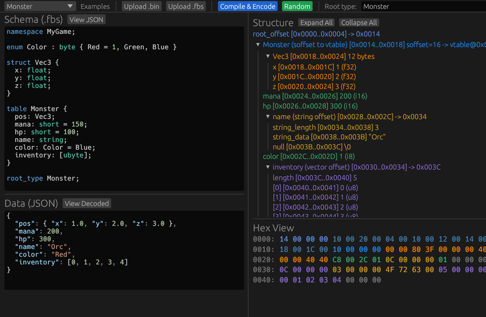

# fbsviewer-lib

Source code for the FlatBuffers binary visualizer. Interactive tool for understanding
FlatBuffers binary encoding, available as a native desktop app and a web app (WASM).

[](https://fbsviewer.shuozeli.com/)
[](https://github.com/Shuozeli/fbsviewer)

> **Try the live demo now: [fbsviewer.shuozeli.com](https://fbsviewer.shuozeli.com/)**
>
> No install required -- runs entirely in the browser via WebAssembly.



## Features

- Paste a `.fbs` schema and JSON or hex data
- Pure Rust JSON-to-FlatBuffers encoder (works on native and WASM)
- Hex view with per-byte coloring by region type (vtable, table, scalar, string, vector, etc.)
- Structure tree with collapsible hierarchy matching the binary layout
- Bidirectional hover highlighting with click-to-lock
- Data format dropdown: switch between JSON and Hex input with auto-conversion
- Template examples (Monster, Simple Scalars, Nested Structs, String Fields)
- Decoded JSON view for inspecting walker output
- File upload support (native: file dialogs, WASM: browser upload)

## Architecture

```
visualizer-core/   Portable library (no GUI deps)
  - Binary walker: parse FlatBuffers binary into annotated regions
  - JSON encoder: JSON -> FlatBuffers binary (pure Rust)
  - JSON decoder: annotated regions -> JSON
  - Hex parser: hex string -> bytes
  - Schema loader: JSON string -> Schema

visualizer/        egui GUI app (native + WASM)
  - Desktop app via eframe
  - Web app via trunk + wasm-bindgen

visualizer-cli/    CLI binary inspection tool
```

## Build

```bash
# Native desktop app
cargo run -p flatbuf-visualizer

# Run tests
cargo test --workspace

# WASM web app
cd visualizer && trunk build --release --public-url ./
```

## Dependencies

Depends on [flatbuffers-rs](https://github.com/Shuozeli/flatbuffers-rs) for schema
compilation (`flatc-rs-compiler`) and schema types (`flatc-rs-schema`).

## Deploy

Pre-built WASM artifacts are published to [Shuozeli/fbsviewer](https://github.com/Shuozeli/fbsviewer)
and auto-deployed to [fbsviewer.shuozeli.com](https://fbsviewer.shuozeli.com/).

## License

MIT
